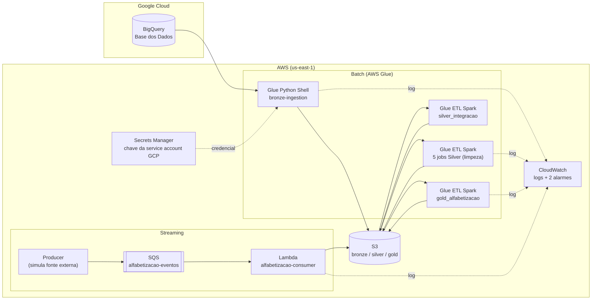

# Pipeline Híbrida para Análise da Alfabetização no Brasil

Pipeline de dados em nuvem que integra fontes públicas do indicador de alfabetização infantil, seguindo a Arquitetura Medalhão (Bronze, Silver, Gold) com ingestão híbrida (batch e streaming). Roda inteiramente na AWS: batch no Glue, streaming em SQS mais Lambda, armazenamento em S3 e observabilidade no CloudWatch.

Tech Challenge Fase 2 — FIAP Pós-Graduação em AI Scientist.

**Vídeo executivo:** _(link a adicionar)_

---

## Contexto do problema

A alfabetização na idade certa é um marco para o desenvolvimento educacional do país. O **Compromisso Nacional Criança Alfabetizada** é a política pública que articula União, estados e municípios com a meta de que todas as crianças estejam alfabetizadas até o fim do 2º ano do Ensino Fundamental, com o horizonte de 2030.

Para medir esse avanço, o INEP realizou em 2023 a Pesquisa Alfabetiza Brasil e definiu o ponto de corte de **743 pontos na escala de proficiência do Saeb**: a partir desse valor, uma criança é considerada alfabetizada. Sobre esse parâmetro foi criado o **Indicador Criança Alfabetizada**, que expressa o percentual de estudantes que atingem esse patamar.

Compreender os fatores associados à alfabetização exige integrar diferentes fontes: metas nacionais, estaduais e municipais, dados territoriais e microdados de desempenho. Essas fontes chegam separadas, em formatos e granularidades distintas. O problema técnico deste projeto é integrá-las em uma base analítica confiável, que sustente análises de desigualdade educacional e o acompanhamento das metas.

## O desafio e o uso do indicador

Os dados vêm da plataforma [Base dos Dados](https://basedosdados.org/), do dataset `br_inep_avaliacao_alfabetizacao`. São sete fontes:

| Fonte | Conteúdo |
|-------|----------|
| `uf` | Taxa de alfabetização agregada por estado |
| `municipio` | Taxa de alfabetização agregada por município |
| `alunos` | Microdados individuais (proficiência por criança), 3,8 milhões de registros |
| `meta_alfabetizacao_brasil` | Metas nacionais até 2030 |
| `meta_alfabetizacao_uf` | Metas por estado |
| `meta_alfabetizacao_municipio` | Metas por município |
| `municipio` (diretório IBGE) | Tabela de referência: nome e UF de cada município |

O indicador é usado de duas formas na camada analítica: comparar a taxa realizada com a meta (onde cada território está em relação ao objetivo de 2030) e observar a evolução no tempo. Os microdados de alunos ficam disponíveis como base para modelos preditivos.

Todas as fontes cobrem o **2º ano do Ensino Fundamental**, foco da política pública. Os dados reais disponíveis são de 2023 e 2024; as metas projetam até 2030.

## Arquitetura

A solução adota a **Arquitetura Medalhão** (Bronze, Silver, Gold) sobre o Amazon S3, com processamento serverless no AWS Glue para o caminho batch e SQS mais Lambda para o caminho de streaming. Os dados de origem residem no BigQuery (backend da Base dos Dados); todo o restante do fluxo roda na AWS.



- **Bronze**: dado cru, uma cópia fiel da fonte, particionado por ano (padrão Hive).
- **Silver**: dado limpo, decodificado e validado, com integração das bases (joins entre indicadores, metas e diretório territorial). Aplica os 4 mecanismos de qualidade e interrompe a gravação em caso de falha.
- **Gold**: datasets analíticos prontos para consumo, orientados às perguntas de negócio. Consome a Silver já integrada, sem joins entre fontes.
- **Streaming**: caminho paralelo que simula a chegada de novas medições de proficiência em near-real-time, gravando na Bronze.

## Fluxo de dados

### Caminho batch

1. **Ingestão (Bronze)**: o job `bronze-ingestion` (Glue Python Shell) consulta cada uma das sete fontes no BigQuery via `google-cloud-bigquery` e grava em Parquet (compressão snappy) no S3, particionado por ano (`bronze/<fonte>/ano=2024/`). O diretório de municípios não tem coluna de ano e é gravado em arquivo único.
2. **Limpeza e validação (Silver)**: cinco jobs Glue ETL (Spark) leem a Bronze, removem duplicatas, decodificam os campos codificados (por exemplo `rede`), e aplicam os 4 mecanismos de qualidade do projeto: detecção de valores ausentes, verificação de duplicidade de chave, validação de chaves de relacionamento e consistência entre tabelas. A tabela `municipio` recebe um left join com o diretório do IBGE para agregar nome e sigla da UF.
3. **Integração (Silver)**: um job adicional (`silver_integracao`) unifica indicadores com metas por território (UF e município), validando a consistência entre as tabelas antes de integrar. Essa etapa produz `municipio_integrado` e `uf_integrado`, que servem como fonte única para a Gold.
4. **Camada analítica (Gold)**: o job `gold_alfabetizacao` (Glue ETL Spark) consome a Silver integrada e produz três datasets analíticos sem joins entre fontes:
   - `indicador_municipio`: taxa realizada, meta 2030, gap para a meta e ranking do município dentro da UF.
   - `metas_vs_resultados_uf`: taxa realizada versus meta 2030 por estado, com percentual de atingimento.
   - `evolucao_uf`: série anual da taxa por estado, com a variação em pontos percentuais ano a ano.

### Caminho streaming

Um **producer** reamostra registros de alunos da Bronze e os publica como eventos individuais na fila **SQS** `alfabetizacao-eventos`, com intervalo configurável para simular fluxo contínuo. A fila aciona a função **Lambda** `alfabetizacao-consumer`, que grava cada evento na Bronze em `bronze/streaming/dt_ingestao=YYYY-MM-DD/`. Esse caminho demonstra o padrão de ingestão near-real-time (um produtor que envia eventos e um consumidor que processa de forma contínua), sem depender de infraestrutura sempre ativa.

O producer simula a fonte externa de eventos: em produção, seria o sistema que gera as novas medições (por exemplo, a correção das provas do Saeb). Como toda origem de dados, ele fica fora da pipeline, do mesmo modo que o BigQuery é a fonte externa do caminho batch. O processamento, da fila em diante, roda inteiramente na AWS.

## Tecnologias e justificativa

| Componente | Tecnologia | Por que |
|------------|-----------|---------|
| Origem | BigQuery (Base dos Dados) | Backend público oficial do dataset do INEP |
| Armazenamento | Amazon S3 | Data lake de baixo custo; base das três camadas em Parquet |
| Ingestão batch | AWS Glue Python Shell | Tarefa de extração e I/O que não se beneficia de cluster distribuído; evita pagar por Spark |
| Processamento batch | AWS Glue ETL (Spark serverless) | Compute escalável gerenciado; mesma lógica portável para EMR sem reescrita |
| Streaming | Amazon SQS + AWS Lambda | Ingestão near-real-time sem servidor ativo; free tier cobre o volume simulado |
| Credenciais de terceiro | AWS Secrets Manager | Cofre gerenciado e criptografado para a chave da service account GCP |
| Observabilidade | Amazon CloudWatch | Logs nativos dos jobs Glue e da Lambda, mais dois alarmes operacionais |
| Formato | Parquet + snappy | Colunar e comprimido; reduz volume lido em consultas analíticas |

**Sobre Kafka**: o desafio pede ingestão híbrida, não uma ferramenta específica. Para o volume de eventos simulado, manter um cluster Kafka ou mesmo Kinesis seria over-engineering. SQS mais Lambda entrega a mesma semântica (produtor e consumidor desacoplados) com custo zero no free tier e sem infraestrutura para operar.

**Sobre processamento local versus Glue**: o volume do dataset (cerca de 275 MB, concentrados na tabela de alunos) não exigiria Spark. A escolha pelo Glue atende o objetivo central do enunciado, uma pipeline escalável em nuvem com compute real, e foi viabilizada pelos créditos da conta. A abstração `get_spark()` detecta o ambiente: no Glue usa a sessão nativa (credenciais via papel IAM do job); localmente usa o conector `s3a` com um profile do AWS CLI. O mesmo código roda nos dois cenários sem alteração.

## Decisões arquiteturais

- **Left join em vez de inner join na Silver**: preserva todo registro de indicador mesmo sem par no diretório de municípios. A validação registra órfãos em log em vez de descartá-los silenciosamente. Na prática o join foi completo, sem órfãos.
- **Manter o código e adicionar a descrição**: os campos codificados (como `rede`) preservam o valor original e ganham uma coluna `_desc` legível, em vez de substituir. Preserva o dado bruto para joins e adiciona legibilidade para consumo.
- **Fail-fast na qualidade**: se houver nulo em chave, duplicidade de chave, chave órfã ou valor fora de faixa, o job levanta erro e não grava. É preferível interromper a gravar dado inconsistente na camada seguinte. Os 4 mecanismos de qualidade (valores ausentes, duplicidade, chaves de relacionamento, consistência entre tabelas) ficam concentrados na Silver.
- **Script parametrizado para as metas**: as três tabelas de meta (Brasil, UF, município) compartilham estrutura, então uma lista de configuração mais uma função evitam triplicar código.
- **Microdados de alunos no grão individual**: a tabela de alunos permanece no grão de aluno, não agregada. As tabelas agregadas respondem às perguntas de política pública; os microdados ficam como base para modelos e para validar a taxa oficial.
- **Particionamento Hive-style por ano**: todas as camadas usam `ano=XXXX/`. Consultas por ano leem apenas a partição necessária, o que reduz custo e melhora desempenho.
- **Foco na rede Municipal na Gold**: os datasets Gold filtram a rede Municipal, alvo direto do Compromisso Nacional Criança Alfabetizada.

### Trade-offs

- **Batch vs streaming**: a maior parte das fontes (metas, indicadores, diretório) é publicada em ciclos avaliativos, o que caracteriza um caso de batch, atendido pelos jobs Glue. O streaming entra para simular a chegada incremental de novas medições de proficiência, demonstrando o padrão híbrido. Cada fonte é tratada pelo modo que corresponde à sua natureza, não por obrigação.
- **Data lake vs data warehouse**: optamos por um data lake em S3 (arquivos Parquet nas três camadas) em vez de um data warehouse gerenciado como o Redshift. O lake tem custo de armazenamento muito menor, aceita dados de granularidades diferentes (dos microdados de aluno aos agregados nacionais) e desacopla armazenamento de compute. A contrapartida é que consultas analíticas exigem uma engine por cima (o próprio Spark do Glue, ou Athena). Para o volume e o objetivo do projeto, o lake é suficiente; um warehouse só se justificaria com consultas interativas intensas e recorrentes sobre a camada Gold.
- **Custo vs performance**: os workers do Glue foram dimensionados no mínimo (2 workers G.1X nos ETL, 1 DPU no Python Shell). Para o volume atual isso já processa em poucos minutos; um cluster maior reduziria o tempo, mas o ganho não compensa o custo. A escolha prioriza custo sobre performance porque o pipeline não tem requisito de latência apertada.

### Segurança

- **Chave do GCP no Secrets Manager**: a Bronze precisa autenticar no BigQuery. Localmente isso vem do login por navegador do `gcloud`; em um job headless, não. A solução é uma service account com chave JSON, guardada no Secrets Manager (cofre criptografado com auditoria de acesso) em vez do S3. Tem custo (cerca de US$ 0,40 por segredo ao mês), mas o rigor de segurança justifica para uma credencial de terceiro.
- **IAM com policies gerenciadas**: a conta é pessoal, isolada e sem dados sensíveis. Para o prazo acadêmico, as policies `FullAccess` foram aceitáveis. Em produção, aplicaríamos least privilege com policy custom escopada ao bucket e às filas específicas, e IAM Identity Center (SSO) no lugar de access keys de longa duração.

## Monitoramento e FinOps

### Monitoramento

Cada etapa da pipeline registra um log estruturado em JSON com nome da etapa, status, duração em segundos e número de linhas processadas (utilitário `monitoramento.Etapa`). Esses logs vão para o CloudWatch de forma nativa nos jobs Glue e na Lambda. Dois alarmes cobrem as falhas operacionais mais relevantes:

- `alfabetizacao-lambda-erros`: dispara em erro na função de streaming.
- `alfabetizacao-glue-falhas`: dispara em falha de job Glue.

### FinOps

O custo real do projeto foi coberto pelos créditos da conta. A tabela abaixo estima a ordem de grandeza mensal da arquitetura no volume atual:

| Item | Base de cálculo | Custo estimado |
|------|-----------------|----------------|
| S3 (storage) | ~275 MB nas três camadas, dentro do free tier de 5 GB | ~US$ 0 |
| Glue ETL (Spark) | Jobs de poucos minutos sobre dados pequenos | Centavos por execução |
| Glue Python Shell (Bronze) | Tarefa leve de I/O | Frações de centavo por execução |
| SQS + Lambda | Dezenas de eventos, dentro do free tier de 1M req/mês | ~US$ 0 |
| Secrets Manager | 1 segredo | ~US$ 0,40/mês |

Decisões que reduzem custo:

- **Parquet com snappy em vez de CSV**: formato colunar comprimido reduz o volume lido por consulta.
- **Particionamento por ano**: consultas leem apenas as partições necessárias.
- **Serverless em vez de cluster provisionado**: não há custo de compute ocioso; paga-se por execução.
- **Glue Python Shell para a Bronze**: a ingestão é I/O-bound e não se beneficia de Spark; evita pagar por um cluster distribuído em uma tarefa que não o exige.
- **Evolução futura**: uma lifecycle policy poderia mover a Bronze antiga para armazenamento frio (Glacier), e a camada Gold poderia ser consultada via Athena, pagando por dados escaneados em vez de manter compute.

## Qualidade de dados

A pipeline implementa quatro mecanismos de validação, todos concentrados na camada Silver (antes da integração e antes da Gold). Se qualquer regra falhar, o job levanta erro e não grava dado inconsistente na camada seguinte (fail-fast).

| Mecanismo | O que verifica | Onde aplica |
|-----------|---------------|-------------|
| **Detecção de valores ausentes** | Nulos em colunas-chave e em campos obrigatórios | Todas as tabelas Silver |
| **Verificação de duplicidade** | Unicidade da chave primária (simples ou composta) | uf, municipio, alunos, metas, diretório |
| **Validação de chaves de relacionamento** | Chaves órfãs entre tabelas (anti-join) | municipio↔diretório, alunos↔diretório, indicador↔meta |
| **Consistência entre tabelas** | Chaves do indicador batem com as da meta antes de integrar | silver_integracao (municipio e UF) |

O módulo `src/qualidade.py` é reutilizado por todos os jobs Silver. As funções (`nulos_em`, `duplicados_em`, `chaves_orfas`, `fora_da_faixa`, `fora_do_conjunto`) recebem o DataFrame e devolvem a contagem de violações. Duas posturas: `checar` interrompe o job (dado corrompido, como nulo em chave), enquanto `avisar` apenas registra a contagem (violação esperada pela natureza do dado).

A distinção nasceu de um caso concreto. A validação de consistência entre indicador e meta apontou 242 municípios com taxa medida mas sem meta 2030 projetada. Em vez de tratar como erro, investigamos: o script `analises/analise_metas_ausentes.py` cruza esses municípios com os microdados de alunos e mostra que a ausência de meta está fortemente associada à baixa participação na avaliação (abaixo de 70% de comparecimento, a maioria dos municípios não recebe meta). É comportamento esperado da fonte, não inconsistência a corrigir. Por isso essa validação virou informativa, e os municípios são preservados na base integrada com meta nula.

## Dashboard

Um dashboard estático com gráficos interativos (hover, zoom, filtro por legenda) é gerado a partir dos datasets Gold:

```bash
pip install plotly
python dashboard/gerar_dashboard.py
```

Produz `dashboard/index.html` com quatro visualizações: ranking de UFs por taxa de alfabetização, meta 2030 versus realizado, evolução temporal por UF e top municípios com maior gap para a meta. Para publicar como site estático no S3:

```bash
aws s3 sync dashboard/ s3://fiap-tc2-286958704145/dashboard/ --profile fiap-tech-challenge
```

## Aplicação em IA

A camada Gold e os microdados foram desenhados para sustentar análises e modelos, não apenas relatórios.

- **Base para modelos preditivos**: os microdados de alunos na Silver mantêm o grão individual, com proficiência, rede, presença, peso amostral e o rótulo `alfabetizado`. Esse conjunto pode alimentar um modelo de classificação para estimar a probabilidade de alfabetização a partir do contexto do estudante, ou um modelo de regressão sobre a proficiência.
- **Priorização de política pública**: o dataset `indicador_municipio` traz o gap para a meta de 2030 e o ranking dentro da UF. Esses campos podem alimentar um modelo de priorização que ordene municípios por distância da meta, apoiando a alocação de recursos.
- **Análise de desigualdade**: as agregações por rede e por território permitem observar padrões geográficos e comparar redes de ensino. As leituras são sempre de associação e comparação, sem inferência de causalidade.
- **Fonte consistente de features**: a Silver, limpa e decodificada, serve de base única para experimentos de modelagem, evitando que cada análise repita a limpeza.

As análises deste projeto descrevem relações observadas nos dados (por exemplo, a diferença entre a taxa realizada e a meta). Não afirmam relações de causa e efeito.

## Como reproduzir

Pré-requisitos: Python 3.9+, credenciais AWS configuradas (profile `fiap-tech-challenge`) e acesso a um projeto GCP com o BigQuery habilitado.

```bash
# 1. Clonar e preparar o ambiente
git clone https://github.com/theocoleone/tech-challenge-2.git
cd tech-challenge-2
python -m venv .venv && source .venv/bin/activate
pip install -r requirements.txt

# 2. Autenticar no GCP (execução local)
gcloud auth application-default login

# 3. Ingestão Bronze (aceita nomes de fonte para teste seletivo)
python src/bronze/bronze_ingestion.py uf        # testa com a menor tabela
python src/bronze/bronze_ingestion.py           # roda todas as fontes

# 4. Camada Silver (limpeza e validação)
python src/silver/silver_uf.py
python src/silver/silver_municipio.py
python src/silver/silver_diretorio_municipio.py
python src/silver/silver_metas.py
python src/silver/silver_alunos.py

# 5. Silver integração (unifica indicadores + metas)
python src/silver/silver_integracao.py

# 6. Camada Gold (datasets analíticos)
python src/gold/gold_alfabetizacao.py

# 7. Dashboard (opcional, requer plotly)
python dashboard/gerar_dashboard.py

# 8. Streaming (simulação)
python src/streaming/producer.py --eventos 20 --intervalo 1
```

Na nuvem, os mesmos scripts rodam como jobs Glue: a Bronze como Glue Python Shell (autenticação GCP via Secrets Manager) e Silver, integração e Gold como Glue ETL Spark. Os módulos compartilhados (`spark_session`, `dicionario`, `monitoramento`, `qualidade`) são empacotados em um zip e passados ao job via `--extra-py-files`.

## Fluxo de trabalho no Git

O desenvolvimento seguiu um fluxo de feature branches com Pull Requests para a `main`, refletindo a evolução do pipeline camada por camada:

| PR | Entrega |
|----|---------|
| #1 | Ingestão Bronze (7 fontes do BigQuery para o S3) |
| #2 | Camada Silver (limpeza, decodificação e integração) |
| #3 | Camada Gold (datasets analíticos) |
| #4 | Ingestão streaming (SQS + Lambda) |
| #5 | Monitoramento (log estruturado por etapa) |
| #6 | Migração para Glue, integração Silver, qualidade completa e dashboard |

Cada camada foi desenvolvida em sua branch, revisada e integrada via PR. As mensagens de commit descrevem a intenção da mudança, e as descrições dos PRs registram as decisões técnicas e como testar.

## Estrutura do repositório

```
tech-challenge-2/
├── README.md
├── requirements.txt
├── Exploração dos Dados.md          # notebook de exploração e descobertas
├── dashboard/
│   └── gerar_dashboard.py           # gera HTML estático com Plotly a partir da Gold
├── analises/
│   └── analise_metas_ausentes.py    # investiga por que 242 municípios não têm meta (lê a Silver)
└── src/
    ├── bronze/
    │   └── bronze_ingestion.py      # BigQuery -> S3 (Parquet, particionado por ano)
    ├── silver/
    │   ├── silver_uf.py             # dedup, decode, validação (unicidade + faixa)
    │   ├── silver_municipio.py      # left join com diretório + validação de chave órfã
    │   ├── silver_diretorio_municipio.py
    │   ├── silver_metas.py          # parametrizado (brasil, uf, município)
    │   ├── silver_alunos.py         # microdados (3,8M linhas), base para ML
    │   └── silver_integracao.py     # unifica indicadores + metas (consistência entre tabelas)
    ├── gold/
    │   └── gold_alfabetizacao.py    # 3 datasets analíticos (sem joins, consome Silver integrada)
    ├── streaming/
    │   ├── producer.py              # publica eventos no SQS
    │   └── lambda_consumer.py       # grava eventos na Bronze
    ├── qualidade.py                 # módulo com os 4 mecanismos de qualidade
    ├── spark_session.py             # sessão Spark (local e Glue)
    ├── dicionario.py                # mapeamentos e helper de decodificação
    ├── monitoramento.py             # log estruturado por etapa
    └── check_silver.py              # verificação rápida de uma tabela Silver
```

## Dicionário de dados

Linguagem de negócio para os campos das camadas analíticas e para os códigos das fontes.

### Campos das camadas analíticas (Gold)

| Campo | Significado |
|-------|-------------|
| `id_municipio` | Código IBGE do município (7 dígitos) |
| `nome` | Nome do município |
| `sigla_uf` | Sigla do estado (ex.: SP, RO) |
| `ano` | Ano de referência do dado (2023 ou 2024) |
| `taxa_alfabetizacao` | Percentual de crianças alfabetizadas ao fim do 2º ano do EF |
| `meta_alfabetizacao_2030` | Meta de taxa de alfabetização projetada para 2030 |
| `gap_para_meta_2030` | Diferença em pontos percentuais entre a meta de 2030 e a taxa realizada |
| `ranking_na_uf` | Posição do município na taxa de alfabetização dentro do seu estado |
| `atingimento_meta_2030_pct` | Quanto da meta de 2030 já foi atingido (taxa dividida pela meta) |
| `taxa_ano_anterior` | Taxa de alfabetização do ano anterior, para comparação |
| `variacao_pp` | Variação da taxa em pontos percentuais em relação ao ano anterior |

### Campos dos microdados de alunos

| Campo | Significado |
|-------|-------------|
| `id_aluno` | Identificador individual do estudante |
| `id_escola` | Identificador da escola |
| `proficiencia` | Pontuação do estudante na escala Saeb (corte de alfabetização em 743) |
| `alfabetizado` | Indica se o estudante atingiu o corte de alfabetização |
| `presenca` | Se o estudante estava presente na avaliação |
| `peso_aluno` | Peso amostral do estudante para cálculos agregados |

### Códigos e suas descrições

**Rede de ensino (`rede`)**

| Código | Descrição |
|--------|-----------|
| 0 | Total (Federal, Estadual, Municipal e Privada) |
| 1 | Federal |
| 2 | Estadual |
| 3 | Municipal |
| 4 | Privada |
| 5 | Pública (Estadual e Municipal) |
| 6 | Pública (Federal, Estadual e Municipal) |

**Série (`serie`)**: 2 = 2º ano do Ensino Fundamental.

**Presença (`presenca`)**: 0 = Ausente, 1 = Presente.

**Preenchimento do caderno (`preenchimento_caderno`)**: 0 = Prova não preenchida, 1 = Prova preenchida.

**Alfabetizado (`alfabetizado`)**: 0 = Não, 1 = Sim.
