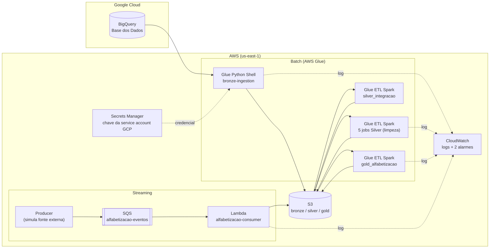
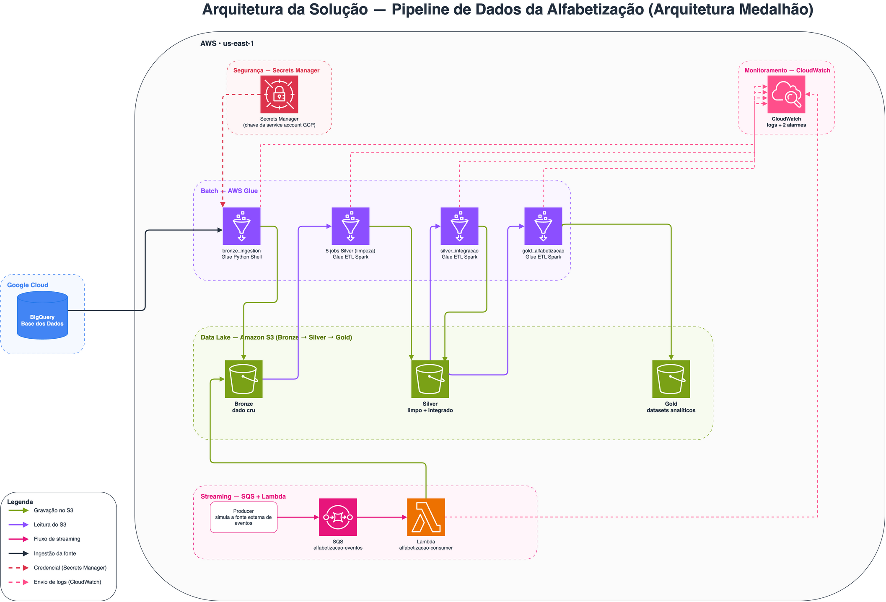
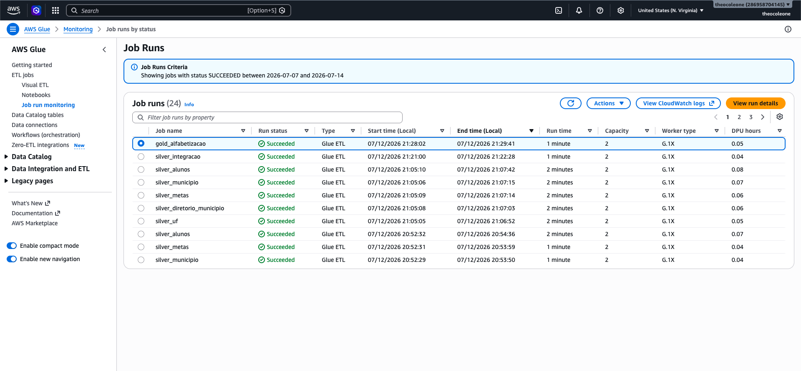
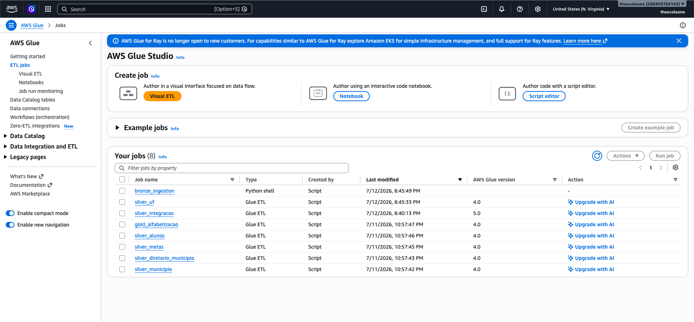
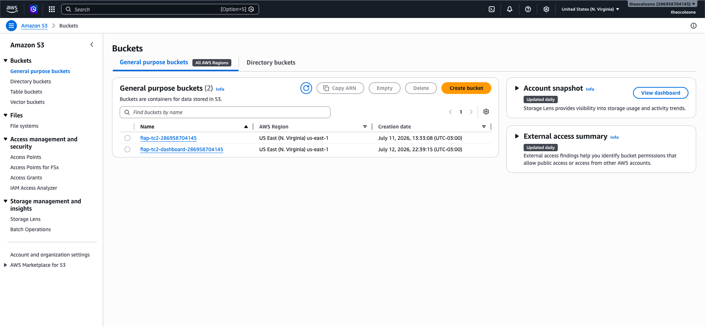
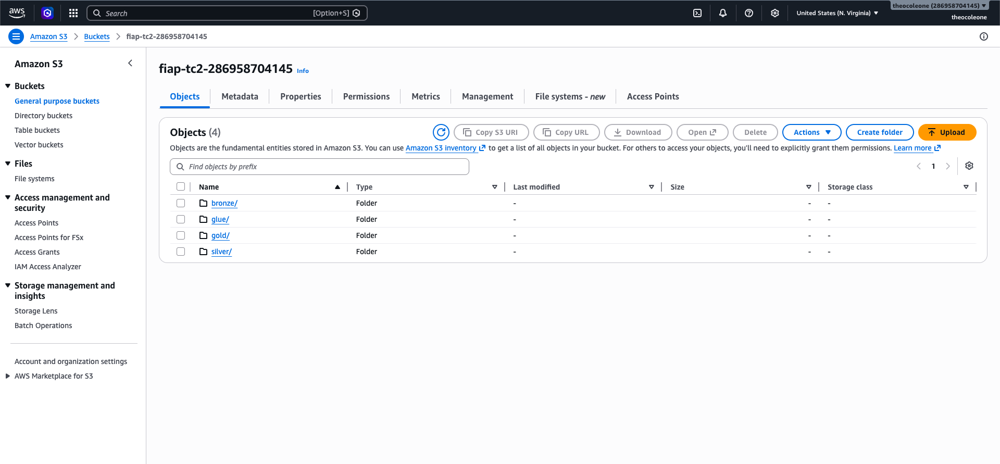
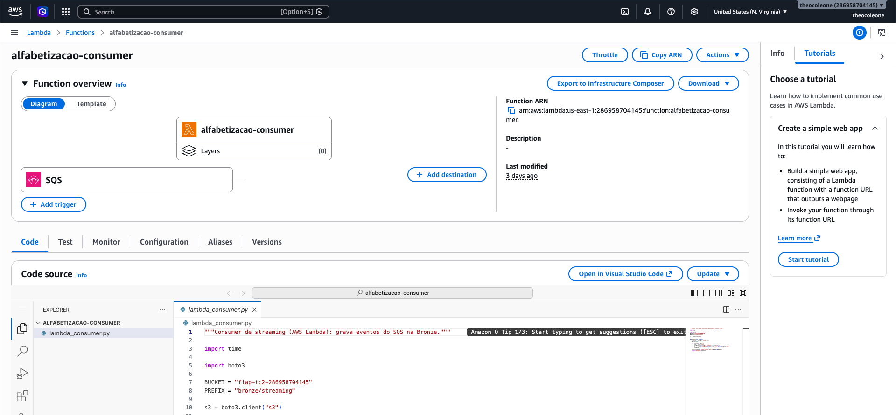
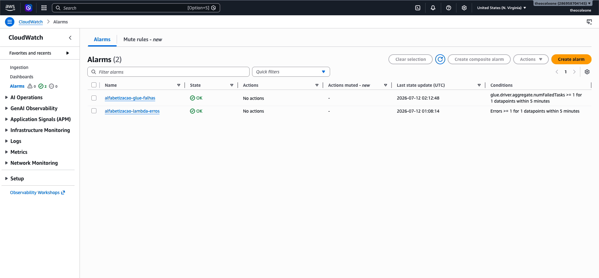
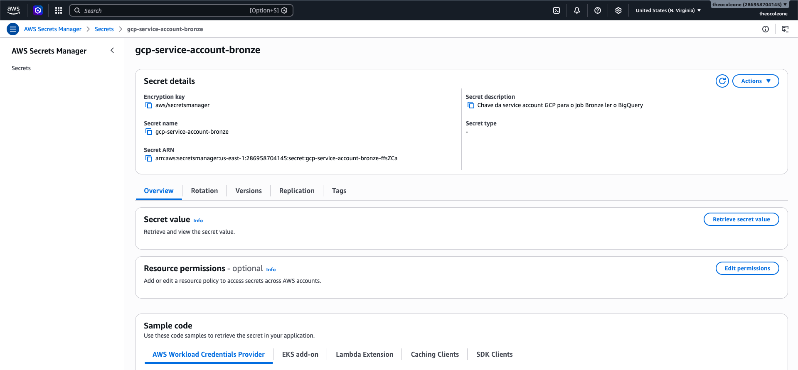
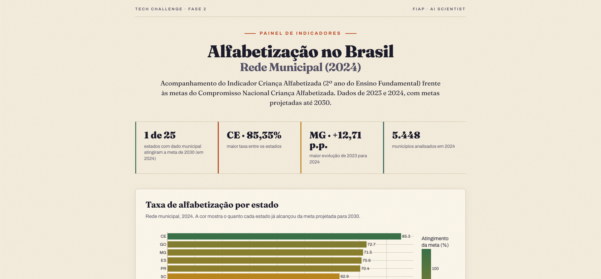

# TECH CHALLENGE FASE 2 — Pipeline de Dados da Alfabetização no Brasil

**Autor:** Theo Coleone de Camargo  
**Curso:** Pós Graduação - AI Scientist - FIAP

**Dashboard:** https://d131u8q9uidloe.cloudfront.net  
**Vídeo executivo:** _(link a adicionar)_

---

## 1. Objetivo do Projeto

Este projeto constrói uma pipeline de dados em nuvem que integra fontes públicas do indicador de alfabetização infantil no Brasil, seguindo a Arquitetura Medalhão (Bronze, Silver, Gold) com ingestão híbrida (batch e streaming). A pipeline transforma dados públicos espalhados em uma base analítica confiável, que sustenta o acompanhamento das metas de alfabetização e análises de desigualdade educacional.

**Foco:**
- Integrar fontes separadas (metas, indicadores, dados territoriais, microdados) em uma base coesa
- Garantir a qualidade do dado com validações que impedem dado inconsistente de avançar
- Rodar de forma escalável e reproduzível na nuvem (AWS)
- Entregar uma camada analítica pronta para consumo e um dashboard visual
- Servir de fundação para modelos de inteligência artificial

---

## 2. Entendimento do Negócio

### 2.1 Qual problema de negócio está sendo resolvido?

A alfabetização na idade certa é um marco do desenvolvimento educacional. O **Compromisso Nacional Criança Alfabetizada** articula União, estados e municípios com a meta de que todas as crianças estejam alfabetizadas até o fim do 2º ano do Ensino Fundamental, no horizonte de 2030.

Para acompanhar esse avanço, é preciso responder **quais territórios estão perto da meta, quais ficaram para trás e onde a situação está melhorando?** A dificuldade é que essa informação chega separada (metas de um lado, resultados de outro, dados de cada estado e município em formatos e granularidades diferentes). O problema técnico é integrar essas fontes em uma base analítica confiável e repetível a cada nova avaliação.

### 2.2 Por que o Indicador Criança Alfabetizada é importante?

O indicador mede o progresso rumo a uma meta de política pública nacional e permite comparar territórios (estados, municípios, regiões) sobre uma mesma régua. Seu ponto de corte é objetivo: uma criança é considerada alfabetizada a partir de **743 pontos na escala de proficiência do Saeb** (Sistema de Avaliação da Educação Básica, o exame nacional do INEP que mede o aprendizado dos estudantes). Ao partir da avaliação individual de cada criança e agregar por território, o indicador conecta o desempenho de sala de aula ao acompanhamento das metas e funciona como um termômetro para priorização de recursos e políticas.

### 2.3 Quais áreas se beneficiam desses insights?

| Área | Benefício |
|------|-----------|
| Secretarias de Educação | Identificar os territórios mais distantes da meta e direcionar recursos e programas para onde a defasagem é maior, em vez de distribuir de forma uniforme |
| Gestão de política pública | Acompanhar a evolução das metas por estado e município ano a ano, comprovando avanço ou justificando novas ações |
| Análise educacional | Estudar padrões de desigualdade regional sobre uma base única e confiável, sem que cada pesquisador refaça a limpeza e chegue a números diferentes |
| Ciência de dados / IA | Antecipar risco: com o dado no grão individual, é possível estimar quais alunos ou municípios tendem a não alcançar a meta e agir antes da próxima avaliação, não só depois |

Sobre o último ponto: manter o dado limpo e no grão individual não beneficia só quem faz modelo. O impacto de negócio é a mudança de postura, de reativo para preventivo. Com o agregado, só se sabe o resultado depois que a avaliação aconteceu. Com o dado individual tratado, dá para construir modelos que sinalizam onde o risco é maior antes da prova, permitindo que a gestão atue de forma antecipada.

### 2.4 Como o indicador é usado e o que os dados cobrem

O indicador é usado de duas formas na camada analítica: (1) comparar a taxa realizada com a meta (onde cada território está em relação ao objetivo de 2030) e (2) observar a evolução no tempo. Os microdados de alunos, no grão individual, ficam disponíveis como base para modelos preditivos.

Quanto ao escopo, todas as fontes cobrem o **2º ano do Ensino Fundamental**, foco da política pública. Os dados reais disponíveis são de 2023 e 2024; as metas projetam até 2030.

---

## 3. Fontes de Dados

Os dados vêm da plataforma [Base dos Dados](https://basedosdados.org/), do dataset `br_inep_avaliacao_alfabetizacao`, mais um diretório territorial auxiliar. São sete fontes:

| Fonte | Conteúdo |
|-------|----------|
| `uf` | Taxa de alfabetização agregada por estado |
| `municipio` | Taxa de alfabetização agregada por município |
| `alunos` | Microdados individuais (proficiência por criança), 3,8 milhões de registros |
| `meta_alfabetizacao_brasil` | Metas nacionais até 2030 |
| `meta_alfabetizacao_uf` | Metas por estado |
| `meta_alfabetizacao_municipio` | Metas por município |
| `municipio` (diretório IBGE) | Tabela de referência: nome e UF de cada município |

O diretório do IBGE (`br_bd_diretorios_brasil.municipio`) foi necessário porque as tabelas municipais de alfabetização trazem só o `id_municipio`, sem nome nem UF. Sem ele não seria possível agrupar municípios por estado ou região, essencial para a análise de desigualdade.

---

## 4. Arquitetura da Solução

A solução adota a **Arquitetura Medalhão** (Bronze, Silver, Gold) sobre o Amazon S3, com processamento serverless no AWS Glue para o caminho batch e SQS mais Lambda para o streaming. Os dados de origem residem no BigQuery (backend da Base dos Dados); todo o restante roda na AWS.





### 4.1 As três camadas da Arquitetura Medalhão

- **Bronze**: dado cru, uma cópia fiel da fonte, particionado por ano (padrão Hive).
- **Silver**: dado limpo, decodificado e validado, com integração das bases (joins entre indicadores, metas e diretório territorial). Aplica os 4 mecanismos de qualidade e interrompe a gravação em caso de falha.
- **Gold**: datasets analíticos prontos para consumo, orientados às perguntas de negócio. Consome a Silver já integrada, sem joins entre fontes.

O caminho de streaming é ortogonal a essas camadas: ele alimenta a Bronze de forma contínua, ao lado da carga batch. As três camadas descrevem os estágios de refinamento do dado; o batch e o streaming são os dois modos de fazer o dado entrar na Bronze.

### 4.2 Caminho batch

1. **Ingestão (Bronze)**: o job `bronze-ingestion` (Glue Python Shell) consulta as sete fontes no BigQuery via `google-cloud-bigquery` e grava em Parquet (snappy) no S3, particionado por ano. O diretório de municípios não tem coluna de ano e é gravado em arquivo único.
2. **Limpeza e validação (Silver)**: cinco jobs Glue ETL (Spark) leem a Bronze, removem duplicatas, decodificam os campos codificados (por exemplo `rede`) e aplicam os 4 mecanismos de qualidade. A tabela `municipio` recebe um left join com o diretório do IBGE para agregar nome e sigla da UF.
3. **Integração (Silver)**: o job `silver_integracao` unifica indicadores com metas por território (UF e município), validando a consistência entre as tabelas antes de integrar. Produz `municipio_integrado` e `uf_integrado`, fonte única para a Gold.
4. **Camada analítica (Gold)**: o job `gold_alfabetizacao` consome a Silver integrada e produz três datasets analíticos, sem joins entre fontes:
   - `indicador_municipio`: taxa realizada, meta 2030, gap para a meta e ranking do município dentro da UF.
   - `metas_vs_resultados_uf`: taxa realizada versus meta 2030 por estado, com percentual de atingimento.
   - `evolucao_uf`: série anual da taxa por estado, com a variação em pontos percentuais ano a ano.

### 4.3 Caminho streaming

Um **producer** reamostra registros de alunos da Bronze e os publica como eventos individuais na fila **SQS** `alfabetizacao-eventos`, com intervalo configurável para simular fluxo contínuo. A fila aciona a função **Lambda** `alfabetizacao-consumer`, que grava cada evento na Bronze em `bronze/streaming/dt_ingestao=YYYY-MM-DD/`.

O producer simula a fonte externa de eventos: em produção, seria o sistema que gera as novas medições (por exemplo, a correção das provas do Saeb). Como toda origem de dados, ele fica fora da pipeline, do mesmo modo que o BigQuery é a fonte externa do caminho batch. O processamento, da fila em diante, roda inteiramente na AWS.

---

## 5. Decisões Técnicas e Trade-offs

### 5.1 Tecnologias

| Componente | Tecnologia | Por que |
|------------|-----------|---------|
| Fonte | BigQuery (Base dos Dados) | Backend público oficial do dataset do INEP |
| Armazenamento | Amazon S3 | Data lake de baixo custo; base das três camadas em Parquet |
| Ingestão batch | AWS Glue Python Shell | Tarefa de I/O que não se beneficia de cluster distribuído; evita pagar por Spark |
| Processamento batch | AWS Glue ETL (Spark serverless) | Compute escalável gerenciado; mesma lógica portável para EMR sem reescrita |
| Streaming | Amazon SQS + AWS Lambda | Ingestão near-real-time sem servidor ativo; free tier cobre o volume simulado |
| Credenciais de terceiro | AWS Secrets Manager | Cofre gerenciado e criptografado para a chave da service account GCP |
| Monitoramento | Amazon CloudWatch | Logs nativos dos jobs Glue e da Lambda, mais dois alarmes operacionais |
| Formato | Parquet + snappy | Colunar e comprimido; reduz volume lido em consultas analíticas |

### 5.2 Batch vs streaming

A maior parte das fontes (metas, indicadores, diretório) é publicada em ciclos avaliativos, ou seja, de tempos em tempos, o que caracteriza um caso de batch, atendido pelos jobs Glue. O streaming entra para simular a chegada incremental de novas medições de proficiência, demonstrando o padrão híbrido. Cada fonte é tratada pelo modo que corresponde à sua natureza, não por obrigação.

**Sobre Kafka:** o desafio pede ingestão híbrida, não uma ferramenta específica. Para o volume de eventos simulado, manter um cluster Kafka ou mesmo Kinesis seria over-engineering. SQS mais Lambda entrega a mesma semântica (produtor e consumidor desacoplados) com custo zero no free tier e sem infraestrutura para operar.

### 5.3 Data lake vs data warehouse

Optou-se por um data lake em S3 (Parquet nas três camadas) em vez de um data warehouse gerenciado como o Redshift. O lake tem custo de armazenamento muito menor, aceita dados de granularidades diferentes (dos microdados de aluno aos agregados nacionais) e desacopla armazenamento de compute. A contrapartida é que consultas analíticas exigem uma engine por cima (o próprio Spark do Glue, ou Athena). Para o volume e o objetivo do projeto, o lake é suficiente.

### 5.4 Custo vs performance

Os workers do Glue foram dimensionados no mínimo (2 workers G.1X nos ETL, 1 DPU no Python Shell). Para o volume atual isso já processa em poucos minutos; um cluster maior reduziria o tempo, mas o ganho não compensa o custo. A escolha prioriza custo sobre performance porque o pipeline não tem requisito de latência apertada.

### 5.5 Processamento local vs Glue

O volume do dataset (cerca de 275 MB, concentrados na tabela de alunos) não exigiria Spark. A escolha pelo Glue atende o objetivo central do enunciado (pipeline escalável em nuvem com compute real) e foi viabilizada por US$ 100 em créditos AWS concedidos na abertura da conta, que cobriram o custo de execução dos jobs. A abstração `get_spark()` detecta o ambiente: no Glue usa a sessão nativa (credenciais via papel IAM do job); localmente usa o conector `s3a` com um profile do AWS CLI. O mesmo código roda nos dois cenários sem alteração.

### 5.6 Outras decisões de modelagem

- **Left join em vez de inner join na Silver**: preserva todo registro de indicador mesmo sem par no diretório de municípios.
- **Manter o código e adicionar a descrição**: os campos codificados (como `rede`) preservam o valor original e ganham uma coluna `_desc` legível.
- **Microdados de alunos no grão individual**: a tabela de alunos permanece no grão de aluno, base para modelos e para validar a taxa oficial.
- **Particionamento Hive-style por ano**: todas as camadas usam `ano=XXXX/`. Consultas por ano leem só a partição necessária, reduzindo custo.
- **Foco na rede Municipal na Gold**: alvo direto do Compromisso Nacional Criança Alfabetizada.

### 5.7 Segurança

- **Chave do GCP no Secrets Manager**: a Bronze precisa autenticar no BigQuery. Em um job headless não há login por navegador, então usa-se uma service account com chave JSON, guardada no Secrets Manager (cofre criptografado com auditoria) em vez do S3.
- **Dashboard isolado dos dados**: o site é publicado em um bucket dedicado, servido por HTTPS via CloudFront; o bucket de dados (Bronze, Silver, Gold) permanece totalmente privado, com bloqueio de acesso público ativo. Isso isola a exposição do site dos dados da pipeline.
- **IAM**: a conta é pessoal, isolada e sem dados sensíveis. Para o prazo acadêmico, as policies `FullAccess` foram aceitáveis; em produção, aplicar-se-ia least privilege escopado ao bucket e às filas, e IAM Identity Center (SSO).

---

## 6. Qualidade de Dados

A pipeline implementa quatro mecanismos de validação, todos concentrados na camada Silver (antes da integração e antes da Gold). Se qualquer regra falhar, o job levanta erro e não grava dado inconsistente na camada seguinte (fail-fast).

| Mecanismo | O que verifica | Onde aplica |
|-----------|---------------|-------------|
| **Detecção de valores ausentes** | Nulos em colunas-chave e campos obrigatórios | Todas as tabelas Silver |
| **Verificação de duplicidade** | Unicidade da chave primária (simples ou composta) | uf, municipio, alunos, metas, diretório |
| **Validação de chaves de relacionamento** | Chaves órfãs entre tabelas (anti-join) | municipio↔diretório, alunos↔diretório, indicador↔meta |
| **Consistência entre tabelas** | Chaves do indicador batem com as da meta antes de integrar | silver_integracao (municipio e UF) |

O módulo `src/qualidade.py` é reutilizado por todos os jobs Silver. As funções recebem o DataFrame e devolvem a contagem de violações. Duas posturas: `checar` interrompe o job (dado corrompido, como nulo em chave), enquanto `avisar` apenas registra a contagem (violação esperada pela natureza do dado).

Essa distinção nasceu de um caso real: a validação de consistência apontou 242 municípios com taxa medida mas sem meta 2030 projetada. Em vez de tratar como erro, investigou-se (ver seção 8) e concluiu-se que é comportamento esperado da fonte. Por isso essa validação virou informativa, e os municípios são preservados na base integrada com meta nula.

---

## 7. Monitoramento e FinOps

### 7.1 Monitoramento

Cada etapa registra um log estruturado em JSON com nome da etapa, status, duração e número de linhas processadas (utilitário `monitoramento.Etapa`). Esses logs vão para o CloudWatch nativamente. Dois alarmes cobrem as falhas mais relevantes:

- `alfabetizacao-lambda-erros`: dispara em erro na função de streaming.
- `alfabetizacao-glue-falhas`: dispara em falha de job Glue.

### 7.2 FinOps

O custo real foi coberto pelos créditos da conta. Ordem de grandeza mensal no volume atual:

| Item | Base de cálculo | Custo estimado |
|------|-----------------|----------------|
| S3 (storage) | ~275 MB nas três camadas, dentro do free tier de 5 GB | ~US$ 0 |
| Glue ETL (Spark) | Jobs de poucos minutos sobre dados pequenos | Centavos por execução |
| Glue Python Shell (Bronze) | Tarefa leve de I/O | Frações de centavo por execução |
| SQS + Lambda | Dezenas de eventos, dentro do free tier | ~US$ 0 |
| Secrets Manager | 1 segredo | ~US$ 0,40/mês |

Decisões que reduzem custo: Parquet com snappy (menos volume lido), particionamento por ano (leitura só da partição necessária), serverless em vez de cluster provisionado (sem compute ocioso) e Glue Python Shell na Bronze (evita Spark numa tarefa de I/O). Evolução futura: lifecycle policy movendo a Bronze antiga para Glacier, e Gold consultada via Athena.

---

## 8. Principais Descobertas

As análises descrevem relações observadas nos dados, sem inferência de causalidade.

- **Apenas o Ceará atingiu a meta.** Na rede municipal, olhando 2024, só o Ceará já alcançou a taxa projetada para 2030 (85,35%, atingimento de 106,69%). Todos os outros estados estão abaixo, vários bastante distantes.
- **Contraste regional.** O topo do ranking concentra Sul, Sudeste e Centro-Oeste; o fundo concentra Norte e Nordeste. É uma associação observada, não uma relação de causa.
- **Evolução.** Alguns estados avançaram bem de 2023 para 2024, com destaque para Minas Gerais (maior variação positiva no período). Os dados mostram que a variação aconteceu; não permitem afirmar o que a causou.
- **Municípios sem meta.** 242 municípios têm taxa medida mas não têm meta 2030 projetada pelo INEP. Investigando (script em `analises/analise_metas_ausentes.py`), a ausência de meta está fortemente associada à baixa participação na avaliação: abaixo de 70% de comparecimento, a maioria dos municípios não recebe meta. É comportamento esperado da fonte, e um achado relevante em si, os territórios sem acompanhamento tendem a ser os de menor cobertura.

O detalhe completo da exploração está em `Exploração dos Dados.md`.

---

## 9. Aplicação em IA

A camada Gold e os microdados foram desenhados para sustentar análises e modelos, não apenas relatórios. A pipeline entrega os dados no formato de que um projeto de IA precisa: limpo, rotulado e no grão certo. Quatro usos concretos:

- **Classificação de risco de não-alfabetização**: os microdados de alunos na Silver mantêm o grão individual, com `proficiencia`, `rede`, `presenca`, `peso_aluno` como possíveis features e o campo `alfabetizado` (0/1) como rótulo pronto. Isso permite treinar um classificador que estime a probabilidade de uma criança não alcançar a alfabetização a partir do seu contexto. O valor prático é agir antes da próxima avaliação, sinalizando alunos e turmas que precisam de reforço, em vez de só constatar o resultado depois.
- **Regressão sobre a proficiência**: em vez de prever só o rótulo binário, um modelo de regressão pode estimar a nota na escala Saeb, útil para prever quão longe do corte de 743 um grupo tende a ficar e dimensionar o esforço necessário.
- **Priorização de política pública**: o dataset `indicador_municipio` já traz o `gap_para_meta_2030` e o `ranking_na_uf`. Esses campos alimentam um modelo (ou até uma regra simples) que ordene municípios por urgência, apoiando a decisão de onde alocar recursos primeiro, uma pergunta direta de gestão.
- **Fonte consistente de features**: por estar limpa, decodificada e integrada, a Silver serve de base única para todos esses experimentos. Sem ela, cada cientista de dados repetiria a limpeza por conta própria e poderia chegar a números diferentes; com ela, todos partem da mesma verdade.

As análises e modelos sempre tratam os padrões como associação e comparação, nunca como relação de causa (ver seção 14).

---

## 10. Dashboard

Como forma de comprovar a consistência dos dados da camada Gold e de tornar os resultados acessíveis a quem não abre um notebook, montou-se um dashboard a partir dos datasets Gold, com gráficos interativos (hover, zoom, filtro por legenda): uma faixa de indicadores-chave e quatro visualizações (ranking de UFs por taxa de alfabetização, meta 2030 versus realizado, evolução temporal por UF e municípios mais distantes da meta). Ele serve tanto de validação visual (números tortos apareceriam de imediato) quanto de entrega final para um gestor.

**https://d131u8q9uidloe.cloudfront.net**

A entrega usa dois níveis: um bucket S3 dedicado hospeda o arquivo, e uma distribuição CloudFront (CDN da AWS) serve o site por HTTPS, com redirecionamento automático de HTTP e cache global. O bucket de dados (Bronze, Silver, Gold) permanece totalmente privado, isolado do site (ver seção 5.7).

---

## 11. Como Reproduzir os Resultados

**Pré-requisitos:** Python 3.9+ | credenciais AWS (profile `fiap-tech-challenge`) | acesso a um projeto GCP com BigQuery habilitado

```bash
# 1. Clonar e preparar o ambiente
git clone https://github.com/theocoleone/tech-challenge-2.git
cd tech-challenge-2
python -m venv .venv && source .venv/bin/activate
pip install -r requirements.txt

# 2. Autenticar no GCP (execução local)
gcloud auth application-default login

# 3. Ingestão Bronze (aceita nomes de fonte para teste seletivo)
python src/bronze/bronze_ingestion.py uf        # testa com a menor tabela
python src/bronze/bronze_ingestion.py           # roda todas as fontes

# 4. Camada Silver (limpeza e validação)
python src/silver/silver_uf.py
python src/silver/silver_municipio.py
python src/silver/silver_diretorio_municipio.py
python src/silver/silver_metas.py
python src/silver/silver_alunos.py

# 5. Silver integração (unifica indicadores + metas)
python src/silver/silver_integracao.py

# 6. Camada Gold (datasets analíticos)
python src/gold/gold_alfabetizacao.py

# 7. Dashboard (opcional, requer plotly)
python dashboard/gerar_dashboard.py

# 8. Streaming (simulação)
python src/streaming/producer.py --eventos 20 --intervalo 1
```

Na nuvem, os mesmos scripts rodam como jobs Glue: a Bronze como Glue Python Shell (autenticação GCP via Secrets Manager) e Silver, integração e Gold como Glue ETL Spark. Os módulos compartilhados (`spark_session`, `dicionario`, `monitoramento`, `qualidade`) são empacotados em um zip e passados ao job via `--extra-py-files`.

**Estrutura do repositório:**

```
tech-challenge-2/
├── README.md                            → Este arquivo
├── requirements.txt                     → Dependências do projeto
├── Exploração dos Dados.md              → Notebook de exploração e descobertas
├── docs/
│   ├── evidencias/                      → Prints da execução na nuvem (seção 12)
│   └── imagens/                         → Diagrama de arquitetura (drawio exportado)
├── dashboard/
│   └── gerar_dashboard.py               → Gera HTML estático com Plotly a partir da Gold
├── analises/
│   └── analise_metas_ausentes.py        → Investiga por que 242 municípios não têm meta
└── src/
    ├── bronze/
    │   └── bronze_ingestion.py          → BigQuery -> S3 (Parquet, particionado por ano)
    ├── silver/
    │   ├── silver_uf.py                 → dedup, decode, validação (unicidade + faixa)
    │   ├── silver_municipio.py          → left join com diretório + validação de chave órfã
    │   ├── silver_diretorio_municipio.py
    │   ├── silver_metas.py              → parametrizado (brasil, uf, município)
    │   ├── silver_alunos.py             → microdados (3,8M linhas), base para ML
    │   └── silver_integracao.py         → unifica indicadores + metas (consistência entre tabelas)
    ├── gold/
    │   └── gold_alfabetizacao.py        → 3 datasets analíticos (consome Silver integrada)
    ├── streaming/
    │   ├── producer.py                  → publica eventos no SQS
    │   └── lambda_consumer.py           → grava eventos na Bronze
    ├── qualidade.py                     → módulo com os 4 mecanismos de qualidade
    ├── spark_session.py                 → sessão Spark (local e Glue)
    ├── dicionario.py                    → mapeamentos e helper de decodificação
    ├── monitoramento.py                 → log estruturado por etapa
    └── check_silver.py                  → verificação rápida de uma tabela Silver
```

---

## 12. Evidências de Execução na Nuvem

Provas de que a pipeline rodou de fato na AWS. As imagens ficam em `docs/imagens/`.

**Jobs Glue concluídos (batch)**



Execuções dos jobs com status SUCCEEDED, com tempo de execução e DPU-hora consumida por run.



Os oito jobs cadastrados: `bronze_ingestion` (Python Shell), os cinco Silver, `silver_integracao` e `gold_alfabetizacao` (ETL Spark).

**Buckets no S3 (dados e dashboard isolados)**



Dois buckets separados: o de dados (privado) e o do dashboard (público), isolando a exposição do site dos dados da pipeline.

**Camadas no S3**



Estrutura Bronze, Silver e Gold dentro do bucket de dados, com o particionamento por ano.

**Streaming (SQS + Lambda)**



A função `alfabetizacao-consumer` processando eventos da fila e gravando na Bronze.

**Monitoramento (CloudWatch)**



Logs estruturados por etapa e os dois alarmes operacionais.

**Credenciais (Secrets Manager)**



O segredo `gcp-service-account-bronze` que guarda a chave da service account do GCP.

**Dashboard publicado (HTTPS via CloudFront)**



O dashboard servido por HTTPS em https://d131u8q9uidloe.cloudfront.net

---

## 13. Fluxo de Trabalho no Git

O desenvolvimento seguiu um fluxo de feature branches com Pull Requests para a `main`, refletindo a evolução do pipeline camada por camada:

| PR | Entrega |
|----|---------|
| #1 | Ingestão Bronze (7 fontes do BigQuery para o S3) |
| #2 | Camada Silver (limpeza, decodificação e integração) |
| #3 | Camada Gold (datasets analíticos) |
| #4 | Ingestão streaming (SQS + Lambda) |
| #5 | Monitoramento (log estruturado por etapa) |
| #6 | Dashboard estático publicado no S3 |

Cada camada foi desenvolvida em sua branch, revisada e integrada via PR. As mensagens de commit descrevem a intenção da mudança, e as descrições dos PRs registram as decisões técnicas e como testar.

---

## 14. Dicionário de Dados

Linguagem de negócio para os campos das camadas analíticas e para os códigos das fontes.

### 13.1 Campos das camadas analíticas (Gold)

| Campo | Significado |
|-------|-------------|
| `id_municipio` | Código IBGE do município (7 dígitos) |
| `nome` | Nome do município |
| `sigla_uf` | Sigla do estado (ex.: SP, RO) |
| `ano` | Ano de referência do dado (2023 ou 2024) |
| `taxa_alfabetizacao` | Percentual de crianças alfabetizadas ao fim do 2º ano do EF |
| `meta_alfabetizacao_2030` | Meta de taxa de alfabetização projetada para 2030 |
| `gap_para_meta_2030` | Diferença em pontos percentuais entre a meta de 2030 e a taxa realizada |
| `ranking_na_uf` | Posição do município na taxa de alfabetização dentro do seu estado |
| `atingimento_meta_2030_pct` | Quanto da meta de 2030 já foi atingido (taxa dividida pela meta) |
| `taxa_ano_anterior` | Taxa de alfabetização do ano anterior, para comparação |
| `variacao_pp` | Variação da taxa em pontos percentuais em relação ao ano anterior |

### 13.2 Campos dos microdados de alunos

| Campo | Significado |
|-------|-------------|
| `id_aluno` | Identificador individual do estudante |
| `id_escola` | Identificador da escola |
| `proficiencia` | Pontuação do estudante na escala Saeb (corte de alfabetização em 743) |
| `alfabetizado` | Indica se o estudante atingiu o corte de alfabetização |
| `presenca` | Se o estudante estava presente na avaliação |
| `peso_aluno` | Peso amostral do estudante para cálculos agregados |

### 13.3 Códigos e suas descrições

**Rede de ensino (`rede`)**

| Código | Descrição |
|--------|-----------|
| 0 | Total (Federal, Estadual, Municipal e Privada) |
| 1 | Federal |
| 2 | Estadual |
| 3 | Municipal |
| 4 | Privada |
| 5 | Pública (Estadual e Municipal) |
| 6 | Pública (Federal, Estadual e Municipal) |

**Série (`serie`)**: 2 = 2º ano do Ensino Fundamental.
**Presença (`presenca`)**: 0 = Ausente, 1 = Presente.
**Preenchimento do caderno (`preenchimento_caderno`)**: 0 = Prova não preenchida, 1 = Prova preenchida.
**Alfabetizado (`alfabetizado`)**: 0 = Não, 1 = Sim.

---

## 15. Limitações e Riscos

- **Período curto**: só há dados reais de 2023 e 2024, então a evolução temporal se limita a dois pontos no tempo. As metas projetam até 2030, mas os dados reais vão só até 2025.
- **Correlação não é causalidade**: os padrões identificados (contraste regional, evolução, associação entre participação e ausência de meta) são associações observadas, não relações de causa.
- **Cobertura da rede municipal**: os dados cobrem 25 das 26 unidades com rede municipal (o Distrito Federal não tem rede municipal; Roraima está ausente da fonte). O dashboard deixa claro que os números se referem aos "estados com dado municipal".
- **Volume**: o dataset é pequeno (275 MB). O uso de Spark/Glue demonstra escalabilidade, mas não é uma exigência do volume atual.

---

## 16. Apresentação

**Vídeo executivo:** _(link a adicionar)_

O vídeo aborda o problema de negócio, a arquitetura da solução, o valor para análises educacionais e o potencial de uso para IA, com demonstração da pipeline rodando na nuvem e do dashboard.
